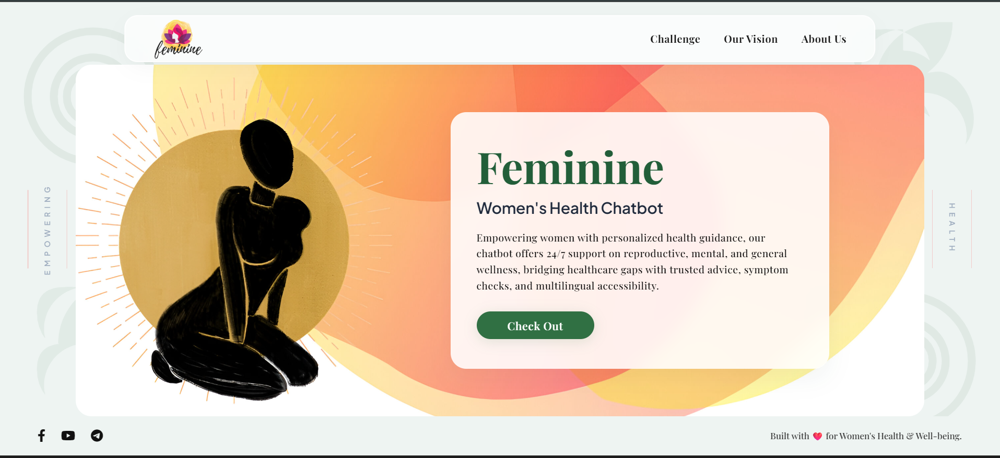
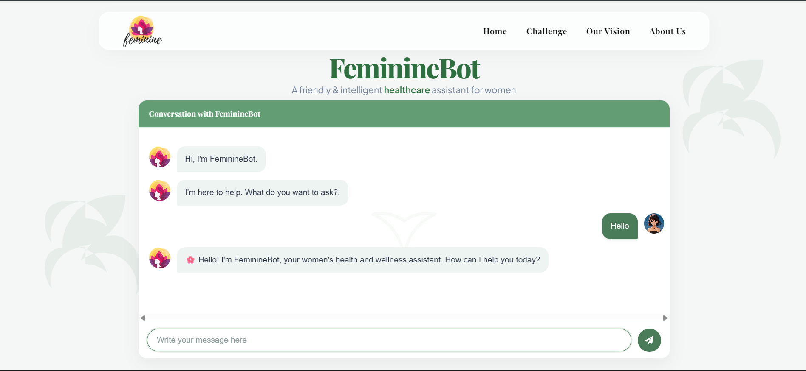
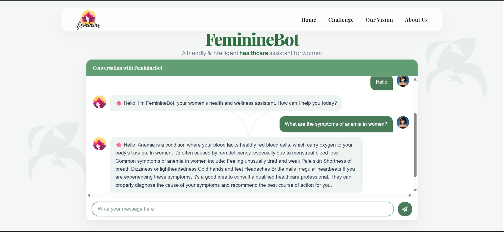
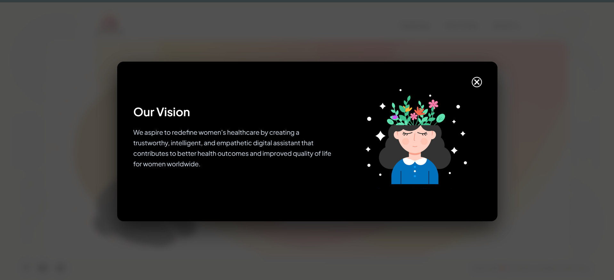
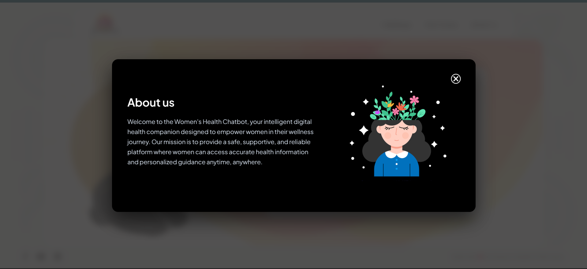
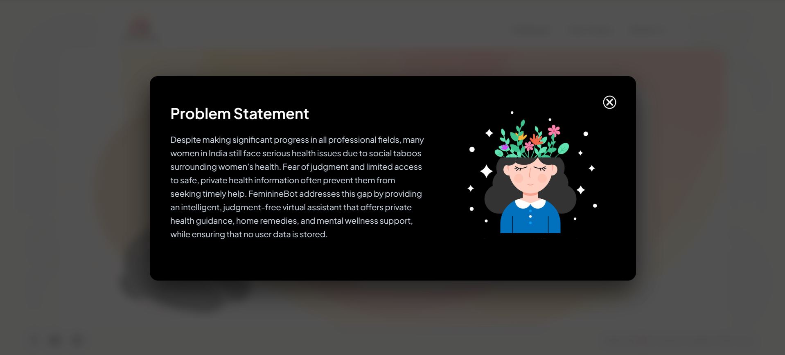

<div align="center">


# 🌸 FeminineBot
### *Your Intelligent Women's Health Companion*

> *"Healthcare accessibility isn't a privilege to women — it is a basic need and should be a priority."*

[](https://reactjs.org/)
[](https://nodejs.org/)
[](https://expressjs.com/)
[](https://ai.google.dev/)
[](https://opensource.org/licenses/ISC)
[](http://makeapullrequest.com)

<br/>

[Get Started](#-installation) • [Features](#-features) • [Screenshots](#-screenshots) • [Contribute](#-contributing)

</div>

---

## 💡 The Problem We're Solving

Women today lead in every field — medicine, engineering, entrepreneurship — yet they often feel unable to talk openly about their own health.

In many parts of the world, especially India, **women's health remains a taboo**. Questions about periods, PCOS, pregnancy, or mental well-being go unasked out of fear of judgment — and sometimes this silence becomes **life-threatening**.

**FeminineBot exists to change that.**

It's a safe, private, judgment-free space where any woman can ask health questions, receive reliable information, and feel supported — anytime, without hesitation. No data is stored. No one is watching. Just honest, helpful answers.


<div align="center">

[🔗 Live Link ](feminine-bot-oehm.vercel.app)  • [📁 Source Code](https://github.com/sandhya144/Feminine-Bot.git)

</div>

---

## 🤖 What FeminineBot Offers

<table>
<tr>
<td width="50%">

### 🩸 Menstrual Health
- PMS remedies and cycle tracking guidance
- Irregular period support
- Menstrual hygiene best practices

### 🤰 Maternal Wellness
- Trimester-by-trimester pregnancy tips
- Postnatal care and breastfeeding support
- Maternal mental health resources

### 🧠 Mental Well-being
- Strategies for postpartum depression & anxiety
- Stress management techniques
- Self-care routines and emotional support

</td>
<td width="50%">

### 🔬 Reproductive Health
- Contraception and fertility education
- PCOS, endometriosis, UTI guidance
- Menopause support and awareness

### 💊 General Health
- Nutrition and fitness for hormonal balance
- Symptom checker with next-step guidance
- When to see a doctor vs. home remedies

### 🛡️ Always Private
- Zero data storage — ever
- No login or personal info required
- Judgment-free, empathetic responses

</td>
</tr>
</table>

---

## 💡 Features

- 💬 **Conversational AI** — Natural chat powered by Google Gemini
- 🎯 **Topic-aware responses** — Trained focus on women's wellness topics
- 🔒 **Privacy-first** — No user data or queries are stored
- ⚡ **24/7 Availability** — Get answers anytime, instantly
- 🖥️ **Clean Chat UI** — Simple, beginner-friendly React interface
- 🌐 **Decoupled Architecture** — Separate frontend and backend for scalability
- 🔧 **Developer Friendly** — Easy local setup with `.env` configuration

---

## 🛠️ Tech Stack

| Layer | Technology |
|---|---|
| **Frontend** | React.js |
| **Backend** | Node.js + Express |
| **AI Engine** | Google Gemini API |
| **Package Manager** | npm |
| **Dev Environment** | Visual Studio Code |

---

## 📸 Screenshots

### 🏠 Homepage

<p align="center">
  
</p>

---

## 🤖 ChatBot Interface
### Welcome Screen

<p align="center">  </p>

### Health Consultation

<p align="center">  </p>

### AI Response

<p align="center">  </p>

---

## 🌸 Website Overview
### Our Vision

<p align="center">  </p>

### About Us

<p align="center">  </p>

### Challenges

<p align="center">  </p>


---


## ⚙️ How It Works

```
User types question
      ↓
React frontend sends message to Express backend
      ↓
Backend forwards prompt to Google Gemini API
      ↓
Gemini generates a safe, informative response
      ↓
Response is displayed in the chat window
```

---

## 🚀 Installation

### Prerequisites

Before you begin, make sure you have:

- [Node.js](https://nodejs.org/) installed
- [npm](https://npmjs.com/) installed
- A [Google Gemini API key](https://ai.google.dev/)
- [Git](https://git-scm.com/) installed

---

### Step 1 — Clone the repository

```bash
git clone https://github.com/sandhya144/Feminine-Bot.git
cd Feminine-Bot
```

### Step 2 — Set up the Backend

```bash
cd backend
npm install
```

Create a `.env` file inside the `backend/` folder:

```env
GOOGLE_API_KEY=your_gemini_api_key_here
PORT=5000
```

### Step 3 — Set up the Frontend

```bash
cd ../frontend
npm install
```

Create a `.env` file inside the `frontend/` folder:

```env
REACT_APP_API_URL=http://localhost:5000
```

### Step 4 — Run the App

**Terminal 1 — Start backend:**
```bash
cd backend
npm start
```

**Terminal 2 — Start frontend:**
```bash
cd frontend
npm start
```

**Open your browser at:**
```
http://localhost:3000
```

---

## 📁 Project Structure

```
Feminine Bot/
├── backend/
│   ├── index.js          # Express server + Gemini API integration
│   ├── package.json
│   └── .env              # API key config (not committed)
│
├── frontend/
│   ├── public/
│   └── src/
│       ├── components/
│       │   ├── chatbot/   # Core chat UI
│       │   ├── layouts/
│       │   ├── pages/
│       │   └── sections/
│       ├── App.js
│       └── index.js
│   ├── package.json
│   └── .env              # Backend URL config (not committed)
│
└── README.md
```

---

## 🔌 API Reference

**Endpoint:** `POST /chat`

| Field | Type | Description |
|---|---|---|
| `message` | `string` | The user's health question |

**Response:**
```json
{
  "reply": "AI-generated health guidance text here."
}
```

---

## ⚠️ Troubleshooting

<details>
<summary><strong>Backend doesn't start</strong></summary>

- Confirm `.env` exists inside the `backend/` folder
- Verify your Gemini API key is valid and active
- Check that port `5000` is not in use by another process

</details>

<details>
<summary><strong>Frontend can't connect to backend</strong></summary>

- Ensure the backend is running before starting the frontend
- Double-check `REACT_APP_API_URL` in `frontend/.env`
- Open browser DevTools → Console to look for CORS or network errors

</details>

<details>
<summary><strong>Empty or broken responses</strong></summary>

- Check server logs in the backend terminal
- Verify the backend is correctly calling the Gemini API
- Confirm request payload and response parsing logic

</details>

---

## 🗺️ Roadmap

- [ ] Conversation history & saved chats
- [ ] User authentication (optional, privacy-preserving)
- [ ] Improved prompt engineering for safer responses
- [ ] Mobile-responsive refinements
- [ ] Multi-language support
- [ ] Deployment guide (Vercel + Railway)
- [ ] Advanced safety filters for sensitive topics

---

## 🛡️ Privacy & Safety Disclaimer

FeminineBot is designed for **informational and educational purposes only**.

It does **not** replace advice, diagnosis, or treatment from a qualified healthcare professional. Always consult a licensed doctor for medical decisions.

Because this project handles sensitive health topics, all responses should be reviewed for accuracy, safety, tone, and appropriate emergency guidance.

---

## 🤝 Contributing

Contributions are warmly welcome! Here's how to get involved:

```bash
# 1. Fork the repository
# 2. Create your feature branch
git checkout -b feature/your-feature-name

# 3. Commit your changes
git commit -m "Add: your feature description"

# 4. Push to your branch
git push origin feature/your-feature-name

# 5. Open a Pull Request
```

Please keep contributions aligned with the project's mission: **helpful, respectful, and beginner-friendly women's health support.**

---

## 📬 Contact

Have feedback, questions, or ideas?

📧 **Email:** [186sndy@gmail.com](mailto:186sndy@gmail.com)
🐙 **GitHub:** [@sandhya144](https://github.com/sandhya144)

---

## 🙏 Acknowledgments

- [Google Gemini](https://ai.google.dev/) — for powering the AI responses
- [React](https://reactjs.org/) and [Express](https://expressjs.com/) communities
- Every woman who inspired this project by deserving better access to health information

---

<div align="center">

Made with 💗 to empower women's wellness

**[⬆ Back to top](#-femininebot)**

</div>
